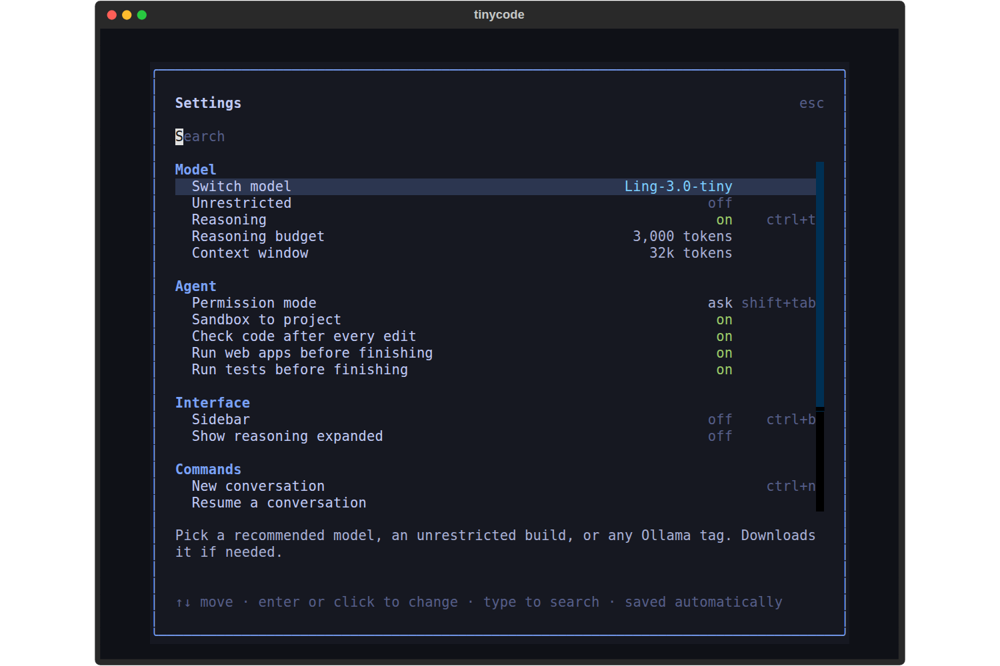
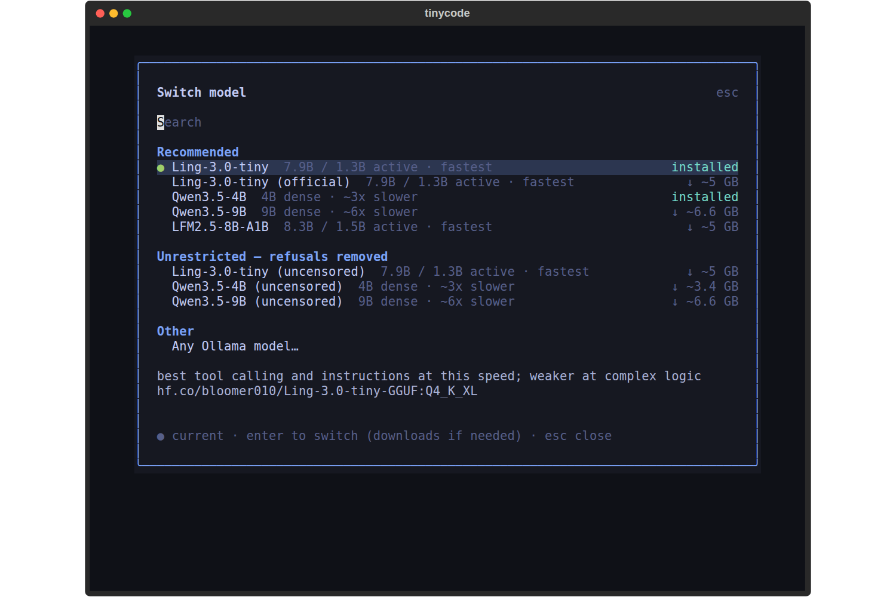

<div align="center">

```
▀█▀ █ █▄ █ █▄█ █▀▀ █▀█ █▀▄ █▀▀
 █  █ █ ▀█  █  █▄▄ █▄█ █▄▀ ██▄
```

**A fast, reliable, fully local coding agent for your terminal.**

Talk to it in plain language. It reads your code, edits files, runs commands and tests, and **proves its work runs** before it says it's done.
It runs on your machine through [Ollama](https://ollama.com), with **Ling-3.0-tiny** by default or Qwen3.5 or an unrestricted build at the press of `ctrl+p`. Nothing leaves your computer.

</div>


## Install (one command)

```bash
curl -fsSL https://raw.githubusercontent.com/the-priest/tinycode/main/install.sh | bash
```

The installer does everything and asks before anything that needs `sudo`:

| | |
|---|---|
| ✓ Python 3.9+ and venv | installed if missing (apt / dnf / pacman / zypper / apk / brew) |
| ✓ tinycode | in its own virtualenv, with a `tinycode` command in `~/.local/bin` |
| ✓ Ollama | official installer if missing. It also offers to switch Ollama from always-on to on-demand. |
| ✓ a model | pick from a short menu (Ling-3.0-tiny by default, about 5 GB), downloaded once with a progress bar |
| ✓ extras | Node.js to run and test the web apps it builds, ripgrep for fast search, an app-menu launcher, a default config, and a `doctor` self-check |

Options: `-y` (no questions), `--no-model`, `--no-ollama`, `--model NAME` (a preset such as `qwen4b`, or any Ollama tag), `--uninstall [--purge]`.
From a clone, run `./install.sh`.

## Use

```bash
cd ~/code/my-project
tinycode
```

Then just ask:

```
❯ the tests in test_api.py fail, find out why and fix it
❯ add a --verbose flag to cli.py and document it in the README
❯ explain how @src/auth.py handles token refresh
❯ !git status
```

| Command | What it does |
|---|---|
| `tinycode [DIR]` | interactive TUI in DIR (default: current directory) |
| `tinycode -c` | continue the last conversation in this directory |
| `tinycode -p "…"` | headless: run the task, print the answer (scripts, CI, pipes) |
| `tinycode --yolo` | auto-approve everything (or `--mode auto-edit`) |
| `tinycode --no-sandbox` | let tools reach outside the project directory (off by default) |
| `tinycode --theme NAME` | colour palette (run `/theme` in the app to browse) |
| `tinycode --no-think` | turn off reasoning for faster replies |
| `tinycode --model qwen4b` | use another model for this run (a preset or any Ollama tag) |
| `tinycode models` | list the recommended models; `tinycode models use qwen9b` makes one the default |
| `tinycode doctor` | check Python, Ollama, the model, tool support and RAM |
| `tinycode update` | upgrade in place |

## Settings and models: `ctrl+p`

Press **`ctrl+p`** anywhere for the settings menu. Click a row or use the arrow keys and enter, or type to search. Changes apply immediately and are saved for next time.

<p align="center"> </p>

- **Switch model:** the recommended models, unrestricted builds, everything you already have in Ollama, or any Ollama tag. A model that isn't downloaded yet is pulled with a progress bar. The old model is unloaded first, so only one sits in RAM.
- **Unrestricted:** flip the current model to its uncensored twin (refusals removed) and back.
- **Reasoning** on/off, **reasoning budget**, and **context window** size.
- **Agent:** permission mode, the project sandbox, and the automatic checks (code checks, web-app runs, tests).
- **Interface:** sidebar, and expanded reasoning.
- **Commands:** new, resume, undo, compact, diff, init, export, help, quit.

## What makes it good

**It checks that the code actually works, not just that it looks right.** Small models write code that looks plausible and doesn't run. tinycode closes that gap with automatic checks that need no extra model time and feed exact errors back to the model:

1. **After every edit:** a fast syntax and bug check on that file (table below).
2. **Web apps get run.** Any HTML page the model builds or changes is loaded with its scripts in a small simulated browser. It needs only Node.js, with no browser or download. tinycode clicks every button, types into inputs, presses keys, runs the game loop, and reports:
   - crashes with file and line, e.g. `clicking "=": TypeError … script.js line 42`, plus a hint like "getElementById('displayy') returned null"
   - broken wiring: `onclick` calling a function that doesn't exist, ids the JavaScript looks up that the HTML doesn't have, `<script src>` files that are missing
   - invalid output such as `NaN`, `undefined` or `[object Object]` appearing on the page
   - wrong behaviour in common apps: a calculator really gets `2 + 3 =` and must show 5, and a todo app must show the item you add
3. **Your tests get run.** If code changed and the project has tests (pytest, npm test, cargo test, go test…), they run before the model is allowed to finish, and failures go back to it.
4. **The model can test its own work** with the `test_app` tool, writing its own scenario: click 7, ×, 6, = and expect the display to show 42.
5. **Finish gate:** when the model says it's done, all of the above runs on what it changed. Anything broken goes back to it to fix, for a few rounds at most. Problems that were already there before its change are left out, so it isn't pushed into edits nobody asked for.

**Catches its own bugs while it works.** Every time the model writes or edits a file, tinycode runs a fast local check on it and puts the result straight into the tool output, with the line number and the offending line, so the model fixes it in its next step:

| Language | Check |
|---|---|
| Python | syntax (built-in compiler), undefined names and similar real bugs (`ruff`, or `pyflakes`, if installed) |
| JavaScript | `node --check` |
| HTML | unclosed and mismatched tags, plus `node --check` on every inline `<script>`, using the file's own line numbers |
| TypeScript | syntax errors (`tsc`) |
| CSS · JSON · TOML · YAML | braces, comments and parse errors |
| Shell · C/C++ · Go · PHP · Ruby | `bash -n`, `gcc -fsyntax-only`, `gofmt -e`, `php -l`, `ruby -c` |

A file that is still being written in chunks is reported as "unfinished, keep going", not as an error. When the model says it's done, every file it changed is checked again. If anything is still broken, the errors go back to it to fix, for a few rounds at most. The sidebar's **PROBLEMS** panel shows what's open, and the model can also run the `check` tool itself on a file or the whole project. A checker whose tool isn't installed is skipped. tinycode also detects the project type and its test command (pytest, npm test, cargo test, go test…) and tells the model.

**Built for a small local model.** Small models make small mistakes. tinycode catches them so a task doesn't fail on one bad tool call:

- **Forgiving edits.** If `old_string` doesn't match exactly, edits still land when the only problem is indentation, whitespace or line numbers copied from `read_file`. The fix is re-indented to fit the file. An edit that is ambiguous or can't be found is never guessed. Instead the model gets back the closest matching region of the file so it can try again.
- **Tool-call repair.** Misspelled tool names (`run_bash`, `str_replace`, `cat`) and argument names (`file_path`, `cmd`, `old`) are mapped to the right ones, and values are converted to the right types. Tool calls the model writes as text (`<tool_call>{…}`, JSON blocks) are recovered.
- **No runaway output.** Repetition loops are detected while the model is still writing and cut off, and each step has a cap on reasoning length. The step is then retried with a focused prompt. Repeating the exact same tool call gets a nudge.
- **Self-correcting.** Errors go back to the model with a hint (for example "Did you mean src/util.py?") instead of crashing.
- **Context that doesn't overflow.** Old tool output is pruned automatically as the context window fills, the token estimate is calibrated against the model's real token counts, and `/compact` summarizes the conversation on demand.
- **Fast.** The system prompt stays fixed for the whole session, so Ollama can reuse its cache between steps. Reasoning can be switched off with `ctrl+t`. The only dependency is Textual.

**You see the work.** The model says in one line what it's doing before each step, and it writes files in chunks of about 80 lines, so you watch a file grow instead of waiting for all of it. Edits show a side-by-side before/after diff, new files show a syntax-highlighted preview, and command output streams live. While Ollama holds back a tool call that is still being written, such as a whole file, the status line shows how many tokens have been generated so far. An experimental `tool_mode = "stream"` setting shows files as they are written, but it depends on the model using a tool-call format tinycode can read.

**Safe by default.**
- Every file edit shows a coloured diff before it is applied. You can answer *Yes*, *Yes, don't ask again*, or *No, and tell it what to do instead*.
- Read-only commands (`ls`, `cat`, `git status`, `grep`, …) run without asking.
- Dangerous commands (`rm -rf ~`, `sudo`, `git push --force`, `curl | sh`, …) always ask, even in yolo mode.
- **Sandboxed to the project.** tinycode is started in one directory and every tool — reads, writes, search and shell — is confined to it. Paths outside (`../`, `~`, `/etc`, absolute paths) are refused with a clear error, whether the model asks for them or a shell command reaches for them. Turn this off with `sandbox = false` if you really need it.
- `/undo` reverts all the file changes from the last turn.

**Nice to use.**
- Streaming markdown answers, collapsible reasoning, and live command output.
- A sidebar with the plan, a context gauge, token speed, and the files changed (`+12 -3`).
- 13 built-in themes borrowed from the terminal world — Tokyo Night, Catppuccin Mocha/Macchiato, Nord, Gruvbox, Dracula, One Dark, Kanagawa, Everforest, Solarized, Ayu Mirage and Material Ocean. Type `/theme` to preview and switch; the whole UI repaints instantly and the choice is remembered.
- `@file` to attach files (with autocomplete), `!cmd` to run a shell command yourself, `/` for the command menu, message history with ↑/↓, and queued messages while the agent is working.
- Sessions are saved automatically; resume one with `/resume` or `tinycode -c`.
- Project memory: tinycode reads `TINYCODE.md` (or `AGENTS.md` / `CLAUDE.md`). Run `/init` to generate one for your project.

**Ollama comes and goes with the app.** tinycode starts `ollama serve` when it launches (or adopts one that is already running), loads the model, and waits until it is in memory. On exit it unloads the model and stops the server, so the RAM is freed. This also happens on `ctrl+c`, when you close the terminal window, on SIGTERM, and on a crash. A server tinycode started is tied to it with `PR_SET_PDEATHSIG`, so the kernel stops it even if tinycode is `kill -9`ed.

## Keys and commands

| Key | | Command | |
|---|---|---|---|
| `enter` | send | `/help` | all commands and keys |
| `shift+enter` / `ctrl+j` / `\`+enter | new line | `/new` | fresh conversation |
| `esc` | interrupt the agent | `/resume` | pick an earlier conversation |
| `shift+tab` | mode: ask → auto-edit → yolo | `/undo` | revert the last turn's file changes |
| `ctrl+t` | reasoning on/off | `/compact` | summarize to free context |
| `ctrl+o` | expand tool output and reasoning | `/init` | write a TINYCODE.md for this project |
| `ctrl+p` | settings, models, commands | `/settings` | same as `ctrl+p` |
| `ctrl+b` | sidebar | `/diff` | files changed this session |
| `ctrl+n` | new conversation | `/model` | switch model (`/model qwen4b` switches directly) |
| `ctrl+l` | clear screen | `/cost` | token usage |
| `ctrl+c` ×2 / `ctrl+q` | quit | `/theme` | switch colour palette |
|  |  | `/export` | save the conversation as markdown |

## Tools the model can use

`read_file` · `edit_file` · `write_file` · `bash` · `test_app` · `check` · `glob` · `grep` · `list_dir` · `todowrite` · `fetch_url`

`glob`, `grep` and `list_dir` skip `.git`, `node_modules`, virtualenvs and build folders. `grep` uses ripgrep when it is installed.

## Configuration

`tinycode config` creates `~/.config/tinycode/config.toml`:

```toml
[model]
model = "ling"         # a preset from `tinycode models`, or any Ollama tag
num_ctx = 32768        # lower if you're short on RAM
num_predict = 16384
think = true           # reasoning: slower but more accurate
think_budget = 3000    # max reasoning tokens per step (0 = unlimited)
tool_mode = "native"   # native: Ollama tool calling · stream: experimental live view

[agent]
mode = "ask"           # ask | auto-edit | yolo
sandbox = true         # confine every tool to the directory you started in
max_steps = 40
auto_check = true     # check every edited file, and again before finishing
app_check = true      # run changed web pages in a simulated browser before finishing
run_tests = true      # run the project's tests before finishing, when code changed

[ollama]
manage_server = true
stop_server_on_exit = true
unload_on_exit = true

[ui]
show_thinking = false  # expand reasoning by default
sidebar = true
theme = "tokyo-night"  # /theme browses all (catppuccin-mocha, nord, gruvbox-dark, dracula, …)
```

The `ctrl+p` menu writes to the same file. Every key can also be set with an environment variable, for example `TINYCODE_NUM_CTX=32768` or `TINYCODE_MODE=auto-edit`. `OLLAMA_HOST` is respected. Personal instructions for every project go in `~/.config/tinycode/TINYCODE.md`.

## Models

All of these run on a CPU (faster with a GPU) and fit in 8 GB of RAM, except Qwen3.5-9B, which wants 16 GB. Switch with `ctrl+p`, `tinycode --model KEY`, or `tinycode models use KEY`.

| Key | Model | Download | Speed on CPU | Good for |
|---|---|---|---|---|
| `ling` (default) | [Ling-3.0-tiny](https://huggingface.co/inclusionAI/Ling-3.0-tiny): 7.9B mixture-of-experts, 1.3B active | 5.3 GB | fastest | everyday edits and reliable tool use; weaker on tricky logic |
| `qwen4b` | Qwen3.5-4B, dense | 3.4 GB | about 3× slower | noticeably better code (LiveCodeBench 55.8) |
| `qwen9b` | Qwen3.5-9B, dense | 6.6 GB | about 6× slower | the best coder under 10B (LiveCodeBench 65.6, BFCL-v4 66.1) |
| `lfm` | LFM2.5-8B-A1B: mixture-of-experts, 1.5B active | ~5 GB | fastest | on-device tool calling; weak at code |
| `ling-official` | inclusionAI's own Ling-3.0-tiny GGUF | ~5 GB | fastest | the same model in the publisher's quantization |

**Unrestricted builds.** `ling-uncensored`, `qwen4b-uncensored` and `qwen9b-uncensored` are community "abliterated" builds with refusals removed. They still call tools normally. In the app, `ctrl+p` → **Unrestricted** switches the current model to its twin and back. They will help with anything, so what you do with them is on you.

Each model family gets its publisher's recommended sampling automatically. Ling and Qwen use temperature 0.6, top_p 0.95, top_k 20 and no repetition penalty, because penalties hurt code where names repeat. Anything you set in `config.toml` wins. Any other Ollama model with tool calling works too: `tinycode --model qwen3:8b`.

## Troubleshooting

- Run `tinycode doctor` first.
- The log is at `~/.cache/tinycode/tinycode.log`.
- **`ollama` not found**: re-run the installer, or install it from https://ollama.com/download.
- **Out of memory**: lower `num_ctx` in the config, or close other models (`ollama ps`).
- **Slow replies**: press `ctrl+t` to turn reasoning off, or lower the reasoning budget in `ctrl+p`.
- **Wrong or weak code**: try a stronger model from `ctrl+p` → Switch model, such as `qwen4b` or `qwen9b`.
- **Uninstall**: `curl -fsSL https://raw.githubusercontent.com/the-priest/tinycode/main/install.sh | bash -s -- --uninstall`

## Development

```bash
git clone https://github.com/the-priest/tinycode && cd tinycode
python3 -m venv .venv && .venv/bin/pip install -e ".[dev]"
.venv/bin/python -m pytest -q        # the tests use a fake Ollama server, so no model is needed
.venv/bin/tinycode --no-boot         # try the UI without Ollama
```

MIT licensed.
